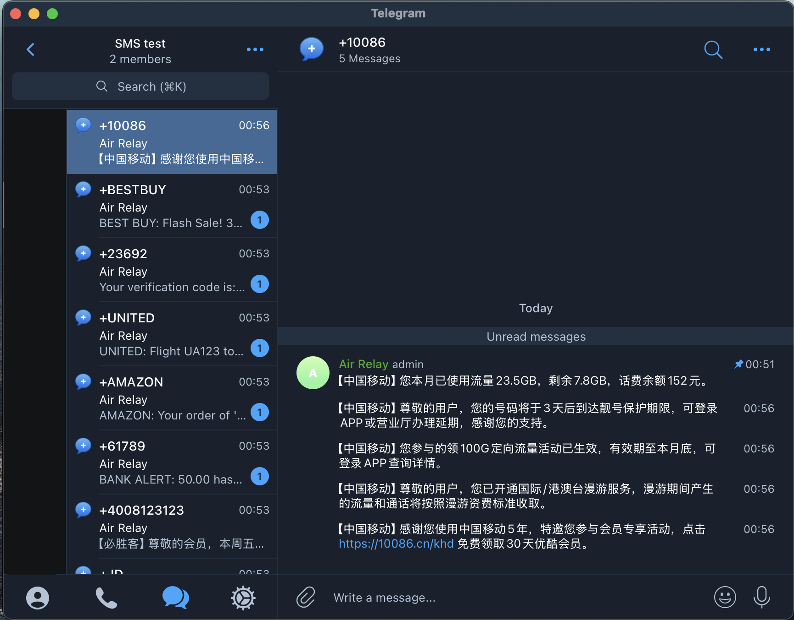

# AirRelay - SMS to Telegram Bridge

English | [中文文档](README.md)

AirRelay is a low-cost system for receiving and replying to SMS messages in Telegram. It connects Air780E device to a Telegram group, organizing conversations by phone number into separate topics.



## Table of Contents

- [Features](#features)
- [Requirements](#requirements)
- [Quick Start](#quick-start)
- [Configuration](#configuration)
- [Device Setup](#device-setup)
- [Telegram Setup](#telegram-setup)
- [Bot Commands](#bot-commands)
- [Troubleshooting](#troubleshooting)
- [License](#license)

## Features

- **Bridge SMS and Telegram**: Air780E hardware receives SMS, AirRelay forwards them to Telegram
- **Read SMS in Telegram**: All incoming SMS appear in your Telegram group
- **Reply via Telegram**: Respond to SMS directly from Telegram
- **Organized Conversations**: Each phone number gets its own topic
- **Device Status**: Monitor your device's connection and signal strength
- **Multiple Admins**: Add other Telegram users as administrators
- **Delivery Status**: See when SMS messages are delivered

For more details on the system architecture, see [System Overview](docs/system_overview.md).

## Requirements

- **Hardware**:
  - [Air780E](https://detail.tmall.com/item.htm?id=709647275715)
  - SIM card with SMS and data capabilities (requires mobile network connectivity)
  - USB Power supply

- **Software**:
  - Docker for running the bridge

- **Accounts**:
  - Telegram API credentials (from [Telegram API Development Tools](https://my.telegram.org/apps))
  - Telegram Bot (create via [BotFather](https://t.me/BotFather))
  - Cloudflare Workers KV account ([Sign up here](https://developers.cloudflare.com/workers/wrangler/workers-kv/))

- **Network**:
  - MQTT broker with a public IP address accessible by the Air780E device

## Quick Start

1. **Clone repository**:
   ```bash
   git clone https://github.com/gaoyifan/AirRelay.git
   cd AirRelay
   ```

2. **Configure settings**:
   ```bash
   cp .env.example .env
   # Edit .env with your credentials
   ```

3. **Start services**:
   ```bash
   docker compose up -d
   ```

4. **Check logs** (optional):
   ```bash
   docker compose logs -f
   ```

## Configuration

Edit the `.env` file with your credentials:

### Telegram Settings
- `TG_API_ID`: Your Telegram API ID ([get here](https://my.telegram.org/apps))
- `TG_API_HASH`: Your Telegram API Hash ([get here](https://my.telegram.org/apps))
- `TG_BOT_TOKEN`: Your Bot Token from [BotFather](https://t.me/BotFather)

### MQTT Settings
- `MQTT_HOST`: MQTT broker hostname (default: localhost)
- `MQTT_PORT`: MQTT broker port (default: 8883)
- `MQTT_USER`: MQTT username (optional)
- `MQTT_PASSWORD`: MQTT password (optional)
- `MQTT_USE_TLS`: Use TLS for MQTT (default: true)

### EMQX Dashboard
- `EMQX_DASHBOARD_USER`: Username for EMQX dashboard
- `EMQX_DASHBOARD_PASSWORD`: Password for EMQX dashboard

For detailed EMQX configuration, see the [EMQX Documentation](https://www.emqx.io/docs/en/v5.0/configuration/configuration.html).

### Cloudflare Workers KV
- `CF_ACCOUNT_ID`: Your Cloudflare account ID
- `CF_NAMESPACE_ID`: Your KV namespace ID
- `CF_API_KEY`: Your Cloudflare API key

## Device Setup

### Hardware Needed
- Air780E
- SIM card with SMS capability
- USB Power supply

### Setup Steps

1. **Flash the firmware**:
   - Download [LuaTools](https://wiki.luatos.com/boardGuide/flash.html)
   - Upload `luatos/main.lua` and `luatos/config.lua` to your Air780E

2. **Configure MQTT** in the `config.lua` file:
   ```lua
   return {
       host = "your.mqtt.server.com", -- Your server IP or domain
       port = 8883,                   -- MQTT port
       isssl = true,                  -- Use SSL/TLS
       user = "your_username",        -- MQTT username
       pass = "your_password"         -- MQTT password
   }
   ```

3. **Power on** the device and check that it connects successfully

4. **Find your IMEI number**:
   - Connect your Air780E to LuaTools
   - The device logs are visible in the main interface of LuaTools
   - Look for a log entry containing "IMEI:" (usually appears during startup)
   - You'll need this IMEI when linking the device to Telegram

## Telegram Setup

1. **Create a Telegram group** with forum topics enabled
   - This requires creating a supergroup and enabling "Topics" in the group settings
   - Only available on Telegram Desktop, mobile apps, or web version

2. **Add your bot** to the group

3. **Make the bot an administrator** with the following permissions:
   - Only "Manage Topics" permission is required
   - Other permissions can remain disabled

4. **Initialize admin access** using the `/add_admin` command
   - The first person to run this command becomes the admin

5. **Link your device** with `/link_device <imei>` (replace with your device's IMEI)
   - Use the IMEI you found in the LuaTools logs

6. **Test the setup** by sending an SMS to your device's number
   - It should appear in your Telegram group

## Bot Commands

- `/start` - Introduction and help message
- `/help` - Show available commands
- `/link_device <imei>` - Connect a device to this group
- `/unlink_device [imei]` - Remove a device connection
- `/link_phone <phone>` - Create a topic for a phone number
- `/unlink_phone [phone]` - Remove a phone number topic
- `/phone_info` - Show which phone number is linked to current topic
- `/status` - Check if device is online and signal strength
- `/add_admin [@username]` - Add another admin user
- `/list_admins` - Show all admin users

## Troubleshooting

### Bridge Issues

- **Check logs**: Run `docker compose logs -f` to see error messages
- **Telegram credentials**: Verify API ID, Hash and Bot Token
- **Cloudflare access**: Ensure your API key has correct permissions
- **Bot permissions**: The bot must be an admin in your Telegram group with "Manage Topics" permission
- **Topics enabled**: Make sure your Telegram group has Topics feature enabled

### Device Issues

- **Network connection**: Check SIM card and signal strength
- **MQTT connection**: Verify your MQTT broker address and credentials
- **SIM card**: Ensure the SIM has SMS capability and mobile data enabled
- **Config file**: Double-check values in the `config.lua` file
- **IMEI number**: Verify you're using the correct IMEI in the `/link_device` command

## License

This project is licensed under the MIT License. 